# GalaxyStays

[Live Link](https://lightsaberbay.onrender.com/#/)

<h1>Description</h1>

Full-Stack, Star Wars themed hotel booking application. Users come to this site to book a hotel stay at their desired hotel in a certain planet for a certain time duration. Users can search for available hotels based on the date range they target, filter by planet, and select a specific room within each hotel. After booking a reservation, they can then cancel their upcoming reservation if they choose.

<h1>Languages and tools used:</h1>

  
  
  
  
  
  
  
  

 
<h1>How to use:</h1>

<h1>Home Page</h1>

You will be greeted with the home page. It will display the name of the app and below, list a couple of random featured hotels and underneath, an ability to redirect to hotels search page based on desired planet. It will also display how many hotels exist in each planet.

 

    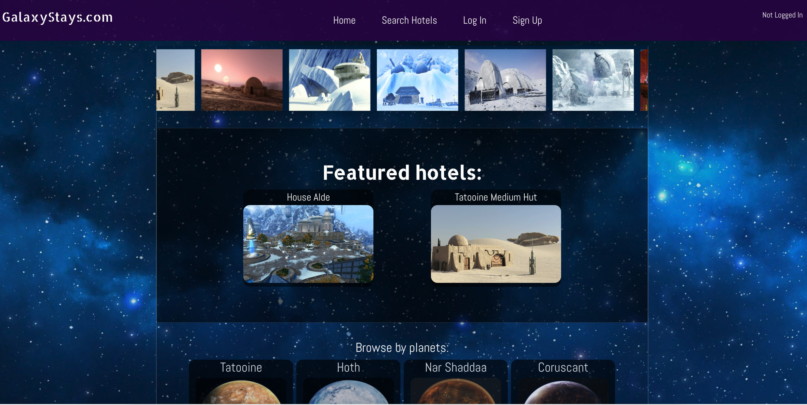

 

## Features:

1. Featured hotels: You will see two featured hotels and a flip card to show you the description on the back.

2. Browse by planet: Immediately be brought to the hotel search page once user clicks on their desired planet, as seen below.

 

  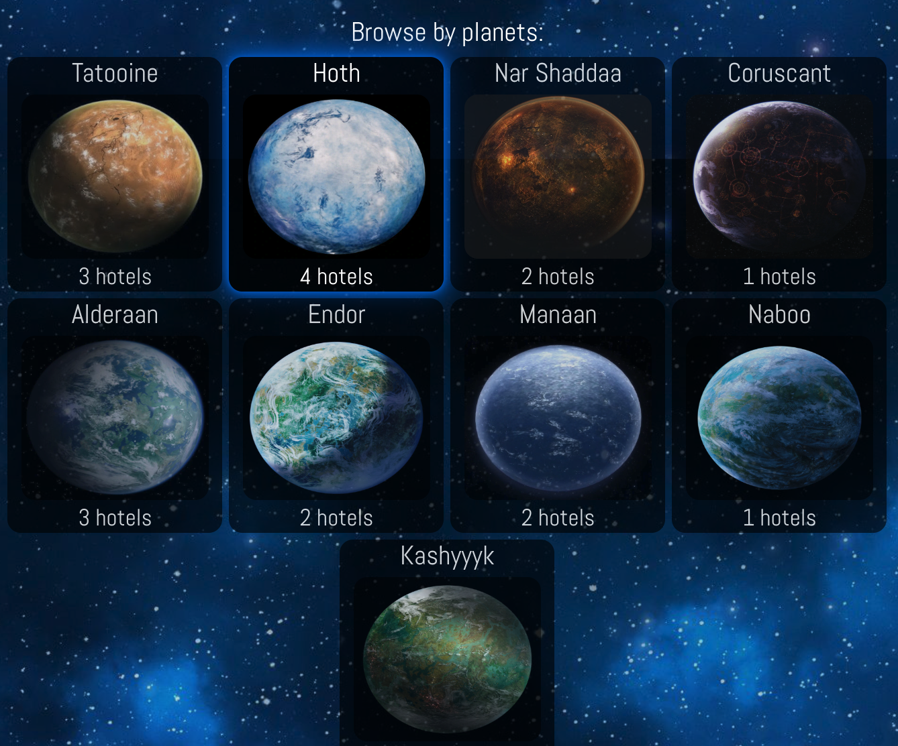

 

Once user clicks on their desired planet, in this case, we will search for all hotels in the planet Tatooine.

<h1>Search Page</h1>

We are now on the search page with the "planet" filter already selected at Tatooine. As you can see, we have 3 results, but no information about how many rooms are available. That's because we haven't selected our dates yet.

 

  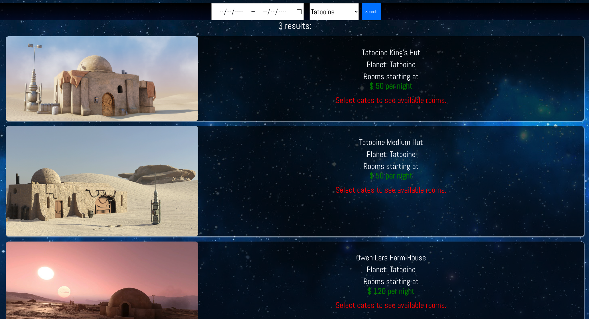

 

## Features:

1. Search bar: Let's then set our planet filter to "No filter" so we can see all hotels that exist.

2. Date duration range: Let's now select our date range so that we can see how many rooms are available per hotel, and the starting price. We will select April 14-April 16.

 

  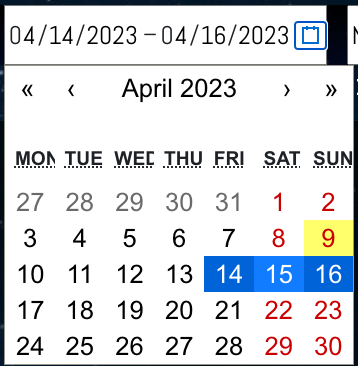

 

Now our results will properly display the starting price of the cheapest room available, and also show us how many rooms are available per hotel. If there are no rooms available at a hotel for the user's specified dates, the hotel listing will not show up at all. We will demonstrate that soon.

 

  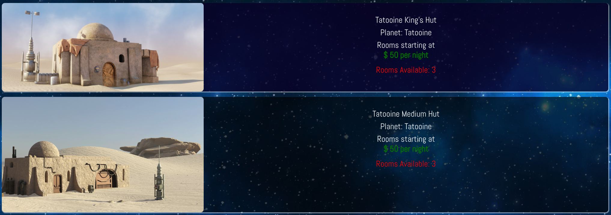

 

Let's scroll to a hotel listing that only has 1 room available. That way, we can book it for those dates and see it properly NOT show up in our search results once we search for those same dates again.

At the bottom of results, I've chosen this hotel called Varykino Villa for $500 a night. I will click on the hotel listing to be brought to the specific hotel page where I can continue to book my reservation.

 

  

 

<h1>Hotel Show Page</h1>

Now I am on the hotel's show page where I see the available rooms. However, I cannot book them unless I'm logged in.

 

  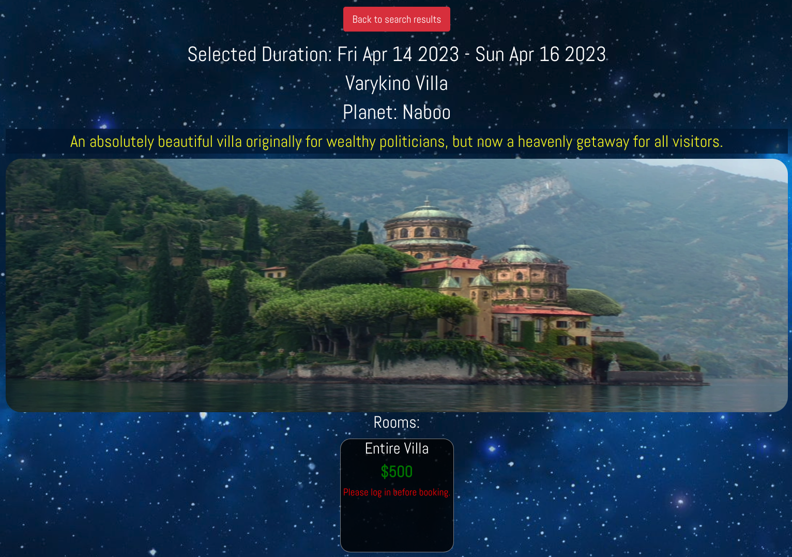

 

<h1>Log In Page</h1>

On the top nav bar, let's go to the log in page.

## Features:

1. Logging in: we will log in as user "Don". If you do not have an account, you may sign up to register instead and it will log you in as well.

 

  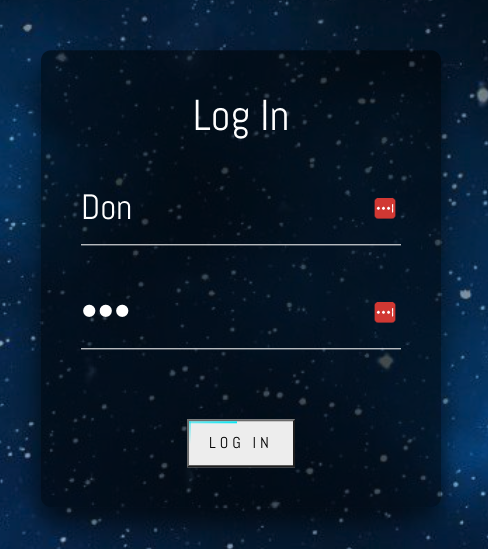

 

After a successful log in, we will be brought back to the home page. Then, we have to go back to the "search hotels" page, but as you can see, our same search results are still there with the date range selected of (April 14-April 16) and the planet filter (No filter) set the way we last left it. Makes it easy!

 

  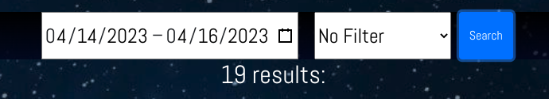

 

Let's go back to the show page of our desired hotel which was the Varykino Villa.

<h1>Back to Hotel Show Page</h1>

## Features:

1. Booking: now that we are logged in, we can now click the "Book" button for the specific room we want. In this case, this hotel only has 1 room which is the entire hotel itself.

 

  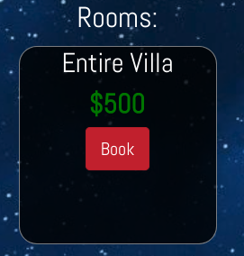

 

Let's click the "book button". We are brought to the booking confirmation page.

<h1>Booking Confirmation Page</h1>

This page reviews all the details of our reservation for review before we confirm (Date duraton, room of hotel, name of hotel, and total price for the number of days we selected multiplied by the price of the room per day).

 

  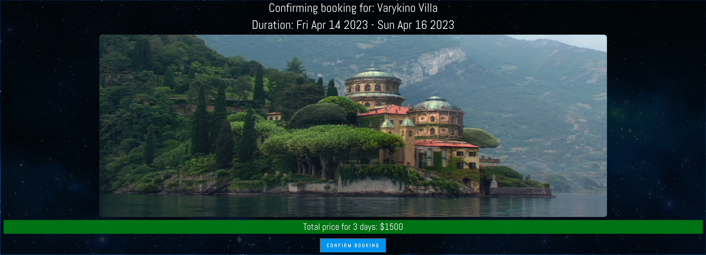

 

We are sure of our decision, so let's confirm the booking using the button below.

Soon, we will be shown our confirmation number and a message that our reservation as been booked successfully.

 

  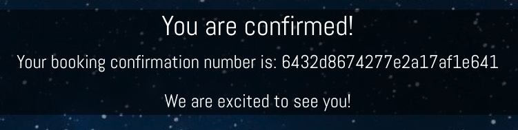

 

Now, let's go to our "My Bookings" page to see all our upcoming reservations.

<h1>My Bookings Page</h1>

We can see that our reservations are here, sorted by the most recent reservation booked at the top. Our current user of "Don" has two upcoming reservations. The one we most recently made was for the Varykino Villa up top.

 

  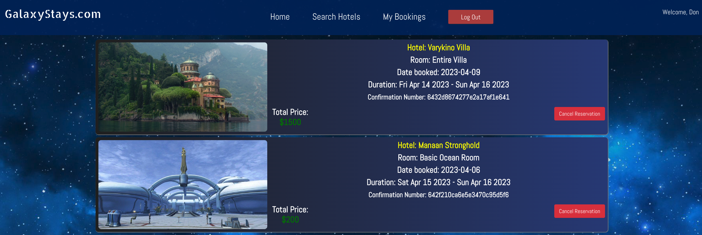

 

Quickly, let's go back to the "Search Hotels" page to now see that since we booked the Varykino Villa for April 14-16, if we searched for that hotel again for those dates, it would not show up. Let's confirm that.

 

  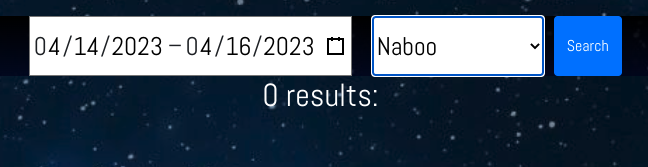

 

I left the date filter as the same dates we left off at, April 14-16, and the planet filter for "Naboo" since the Villa was the only hotel on the planet Naboo.

As expected, there are 0 results for the dates we selected, since we already booked it for that date, making it unavailable to anyone else for those dates. 

Now, back to our bookings page.

## Features:

1. Cancelling a Reservation: Let's say we would like to cancel our reservation for the Villa because we've changed our mind. A button at the corner of the booking will allow us to do so.

But before we click on it, the app will display a modal checking if we are certain about our decision.

 

  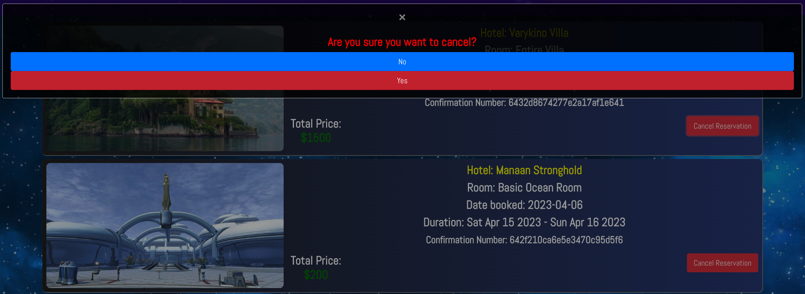

 

We click "yes" and now our bookings page is properly updated, no longer displaying that booking for that villa.

 

  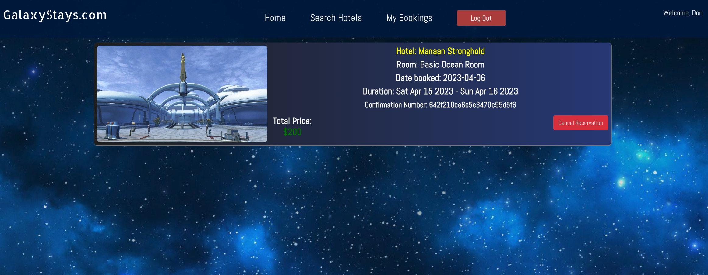

 

Now, let's navigate back to the Search Hotels page once more, to check that the Varykino Villa we cancelled our reservation for, is now available for April 14-16.

As expected, it's now available as a search result for those dates:

 

  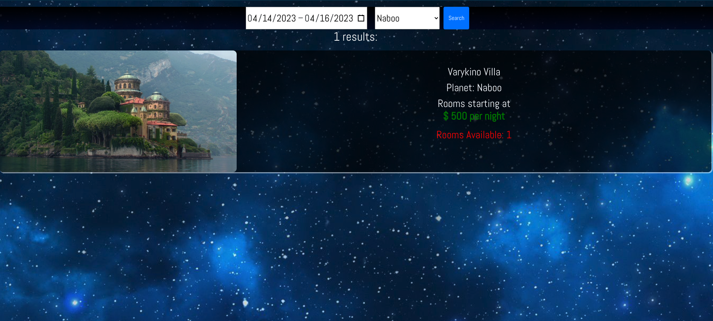

 

Once we are done with our hotel booking, we can log out and return another time. A modal will appear confirming our decision.

 

  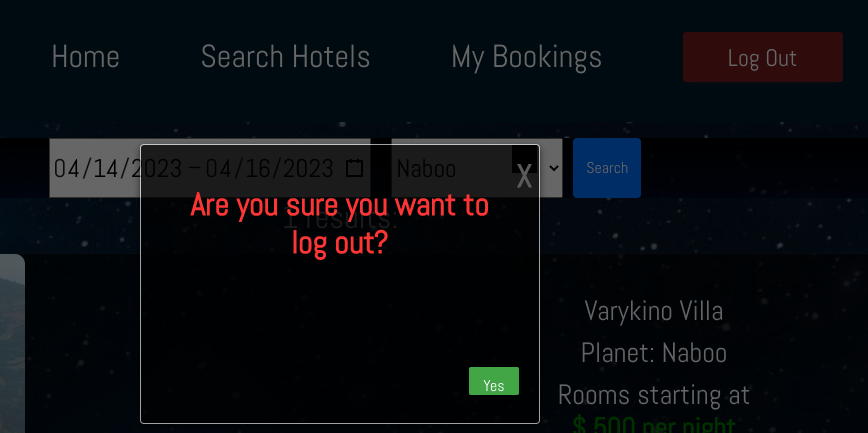

 

